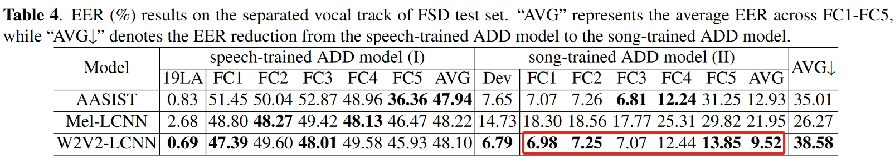

# FSD-Dataset
 This repository presents a subset of the FSD dataset for song deepfake detection.
 FSD is our our work titled "FSD: An Initial Chinese Dataset for Fake Song Detection," which was available on arxiv at "https://arxiv.org/abs/2309.02232".
## Update
- We have released all fake song samples (16k version) for non-commercial academic research. You can access them via the following link: https://drive.google.com/drive/folders/19J4Y3lvbL12Z29irO7HNrfFvgA1mkyVz?usp=drive_link. The folder contains all song samples, vocal samples, and short segments divided by breath pauses (for training). When applying for access to the dataset, please be sure to provide your name, affiliated institution, and intended use.

- We have released the best song-trained ADD model, W2V2-LCNN, as outlined in the paper. The output logits can be seen in `/Inference_score`.
 The speech-trained ADD model by 19LA, W2V2-LCNN, can be found in this repository [ADD-W2V2-LCNN-19LA0.6](https://github.com/xieyuankun/ADD-W2V2-LCNN-19LA0.6).
## Inference
Run `python generate_FSD_online.py` to generate the result txt. 

Get EER result, run `python evaluate_FSD.py`.

Test the model on your dataset, please modify `/wav2vec2_xls-r300-song/raw_dataset.py`.

Line28 `self.path_to_audio = '/data2/xyk/evalvocal/F01/wav'` to your song fold.

Line29 `self.path_to_protocol = '/data2/xyk/evalvocal/F01/label.txt'` to your song label like `/label`.
 
- The provided model is trained by the extracted vocal track of FSD training set, thus, for any inference, please extract the 
vocal track of the original song by [UVR5](https://github.com/Anjok07/ultimatevocalremovergui) first.

## Reference
- [The implementation of F01-F03 methods](https://github.com/svc-develop-team/so-vits-svc)
- [The implementation of F04 method](https://github.com/MoonInTheRiver/DiffSinger)
- [The implementation of F05 method](https://github.com/RVC-Project/Retrieval-based-Voice-Conversion-WebUI)
- [The implementation of audio source separation tool](https://github.com/Anjok07/ultimatevocalremovergui)
- [The code structrue of audio deepfake detection model](https://github.com/yzyouzhang/ASVspoof2021_AIR)