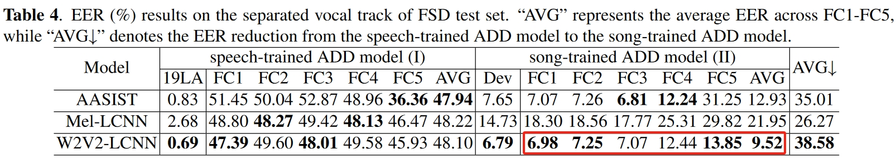

# FSD-Dataset  
This repository presents the FSD dataset for song deepfake detection.  

FSD is our our work titled "FSD: An Initial Chinese Dataset for Fake Song Detection," which was available on arxiv at "https://arxiv.org/abs/2309.02232". 


## 📢 Update  
- We have released **all song samples (16k version)** for **non-commercial academic research**.  
  

    The folder contains:  
    - **16k_FSD.zip** — the 16kHz version of FSD, segmented into 4-second clips.  
    - **16k_FSD_vocal (Demucs).zip** — unclean vocal tracks extracted from *16k_FSD.zip* using [Demucs](https://github.com/facebookresearch/demucs).  
    - **16k_FSD_vocal (VAD).zip** — clean vocal segments obtained with voice activity detection (VAD).  

    If you need to reproduce the experiments, please download 16k_FSD.zip and organize the training, validation, and test sets according to the structure provided in the label folder.

## 🔒 Access Policy (Application Required)  
To protect the rights of original content owners and ensure responsible usage, **this dataset is not publicly downloadable**.

Researchers must request access by completing the form linked below:

👉 [FSD Dataset](https://drive.google.com/drive/folders/19J4Y3lvbL12Z29irO7HNrfFvgA1mkyVz?usp=drive_link)

Applicants must provide:
- Full name  
- Institutional affiliation (university/lab/organization)  
- Academic/professional email  
- Intended use of the dataset  
- Agreement to the terms described in the LICENSE file in this repository

Once approved, a private Google Drive link to the dataset will be shared.


## 📜 Terms of Use  
By requesting, accessing, or downloading this dataset, you **agree unconditionally** to:  

1. **Academic Research Only**  
   - Non-commercial academic use only.  

2. **Personal Use Only**  
   - Access is granted to the approved applicant only.  
   - Redistribution, sharing, or re-uploading is strictly prohibited.  

3. **No Commercial Use**  
   - Prohibited: commercial training, product development, paid services, or any profit-driven activity.  

4. **Attribution Required**  
   - Cite the dataset clearly in any publications/presentations.  
   - Include a link to this repository.  

5. **Legal Liability**  
   - Misuse may result in legal action, revocation of access, and public disclosure.  


## ⚠️ Disclaimer  
This dataset includes audio collected from publicly available online media.  
- All copyrights belong to the original content owners.  
- We **do not** claim ownership of the original media.  
- Distribution follows **academic fair use principles**.  
- If you are a copyright holder and wish to remove your content, please contact us.  


## Song deepfake detection

We have released the **best song-trained ADD model (W2V2-LCNN)** as described in the paper.  
  Output logits are available in `/Inference_score`.  

    

  The **speech-trained ADD model (19LA)** can be found here:  
  [ADD-W2V2-LCNN-19LA0.6](https://github.com/xieyuankun/ADD-W2V2-LCNN-19LA0.6)  

Run `python generate_FSD_online.py` to generate the result txt. 

Get EER result, run `python evaluate_FSD.py`.

Test the model on your dataset, please modify `/wav2vec2_xls-r300-song/raw_dataset.py`.

Line28 `self.path_to_audio = '/data2/xyk/evalvocal/F01/wav'` to your song fold.

Line29 `self.path_to_protocol = '/data2/xyk/evalvocal/F01/label.txt'` to your song label like `/label`.
 
The provided model is trained by the extracted vocal track of FSD training set, thus, for any inference, please extract the 
vocal track of the original song by [Demucs](https://github.com/facebookresearch/demucs) first.


## Reference
- [The implementation of F01-F03 methods](https://github.com/svc-develop-team/so-vits-svc)
- [The implementation of F04 method](https://github.com/MoonInTheRiver/DiffSinger)
- [The implementation of F05 method](https://github.com/RVC-Project/Retrieval-based-Voice-Conversion-WebUI)
- [The implementation of audio source separation tool](https://github.com/Anjok07/ultimatevocalremovergui)
- [The code structrue of audio deepfake detection model](https://github.com/yzyouzhang/ASVspoof2021_AIR)

## 📌 Citation

If you use this dataset, please cite:

```
@inproceedings{xie2024fsd,
  title={FSD: An initial chinese dataset for fake song detection},
  author={Xie, Yuankun and Zhou, Jingjing and Lu, Xiaolin and Jiang, Zhenghao and Yang, Yuxin and Cheng, Haonan and Ye, Long},
  booktitle={ICASSP 2024-2024 IEEE International Conference on Acoustics, Speech and Signal Processing (ICASSP)},
  pages={4605--4609},
  year={2024},
  organization={IEEE}
}
```
